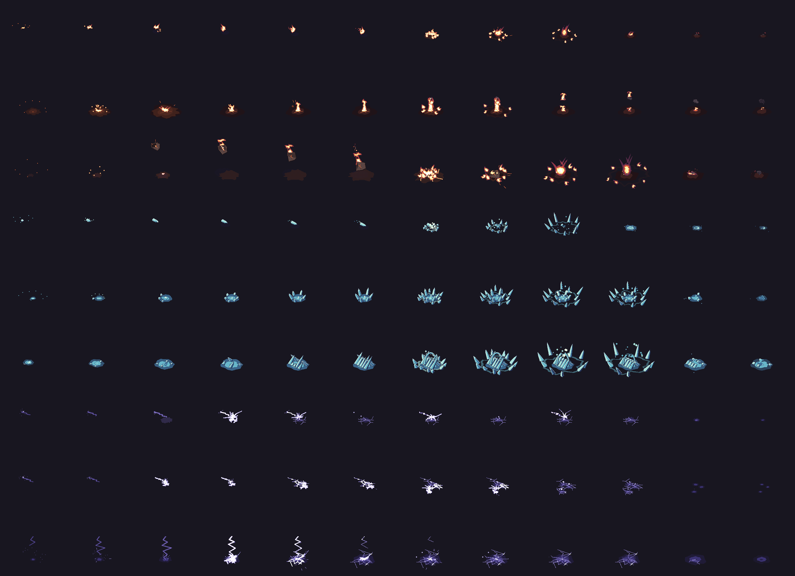

# MOTORFX2 — Atelier de magie en pixel art

Atelier de création de FX pour jeu isométrique : composer, animer, orienter et
exporter des sorts en pixel art, sous un contrat ferme — **douze images par
sort et par direction, trois rangs S / M / L par élément**.



## Ce qui tourne aujourd'hui

| Famille | S | M | L |
|---|---|---|---|
| **Braise** (feu) | Poing de braise — masse lancée, éclatement en gerbe montante | Pilier du dragon — colonne qui jaillit du sol et se déchire | Cœur de comète — masse rocheuse venue du ciel, impact lourd |
| **Aurore** (glace) | Aiguille d'aurore — prisme rigide, rupture nette | Jardin de givre — couronne de prismes qui pousse par paliers | Cathédrale boréale — front de gel et nervures levées |
| **Orage** (foudre) | Fil d'orage — une couture entre deux attaches, avec reprise | Ricochet ionique — trois sauts, trois nœuds, trois coupures | Couronne du tonnerre — frappe verticale et branches au sol |

Neuf recettes, chacune avec son propre opérateur. Chaque sort s'exporte en 8 ou
16 caps échantillonnés dans le repère monde — soit 96 ou 192 cellules d'atlas,
jamais plus de douze images par direction.

- Corps en **pixels indexés** (palette par rôles), passe lumineuse séparée et
  optionnelle, ombre portée tramée.
- Trente-sept **motifs dessinés** originaux, écrits en ASCII par rôles.
- Un système de **particules déterministes** orientées par le cap : braises,
  étincelles, cendres, fumée, éclats, poudrin, brume, arcs — avec un
  vocabulaire propre à chaque élément et des ondes construites dans le plan du
  sol, donc justes dans les huit directions.
- Retouches **non destructives**, signées sur la base : si la génération
  change, la correction est signalée obsolète au lieu d'être appliquée ailleurs.
- Atelier web : bibliothèque S/M/L, scène isométrique avec personnage témoin,
  comparaison des caps, timeline des douze cellules avec expositions et
  événements, pelure d'oignon, crayon / gomme / pipette, annuler-rétablir,
  sauvegarde de session et projet portable.
- Export : atlas corps + émission, manifeste versionné, images séparées,
  animation de contrôle, pack ZIP depuis le navigateur.

## Démarrer

```bash
npm install
npm test                 # 75 tests
npm run dev              # l'atelier, sur un serveur local
npm run render -- --all --dirs 8 --out out
```

`npm run dev` sert l'atelier ; l'ouvrir par double-clic ne fonctionne pas, les
modules et le Worker exigent un serveur HTTP. Sans Worker disponible, l'atelier
bascule sur un rendu synchrone et le dit dans sa barre d'état.

Les autres commandes — planches, animations de contrôle, inspection des bornes,
résumé mesuré — sont listées dans [`docs/export.md`](docs/export.md).

## Documentation

| Document | Contenu |
|---|---|
| [`docs/bible-arcane-miniature.md`](docs/bible-arcane-miniature.md) | La direction artistique, et comment chaque règle se vérifie |
| [`docs/architecture.md`](docs/architecture.md) | Modules, décisions et leurs raisons, coût mesuré |
| [`docs/conventions-spatiales.md`](docs/conventions-spatiales.md) | Repères, projection, caps, capacités directionnelles |
| [`docs/formats.md`](docs/formats.md) | Recette, motif, projet, retouche, et tous les diagnostics |
| [`docs/export.md`](docs/export.md) | Contenu d'un pack, manifeste, commandes, Unity |
| [`docs/avancement.md`](docs/avancement.md) | État réel jalon par jalon et prochaine action |
| [`unity/README.md`](unity/README.md) | Intégration Unity et son état de validation |

## Limites de cette version

- Aucun **test de reconnaissance avec des participants** n'a été mené : les
  neuf sorts passent une mesure automatique de distinction, aucun taux n'est
  annoncé.
- **Unity n'a pas été exécuté** ici : le code d'intégration est fourni et relu,
  sa validation réelle reste ouverte.
- L'**eau et les réactions** (eau + foudre, eau + glace) ne sont pas
  implémentées ; les neuf autres éléments de la matrice sont des concepts
  déclarés comme tels dans le catalogue.
- Les **passes avant/arrière** existent dans le renderer mais ne sont pas
  pilotées depuis l'atelier ; le tri en profondeur reste global par objet et ne
  résout pas deux rubans qui se croisent.
- L'atelier ne propose pas encore la **sélection de clusters**, le remplacement
  de motif ni l'import de PNG + JSON externes.

Les ressources livrées sont originales. Aucun sprite extrait d'un jeu
commercial n'est inclus.
